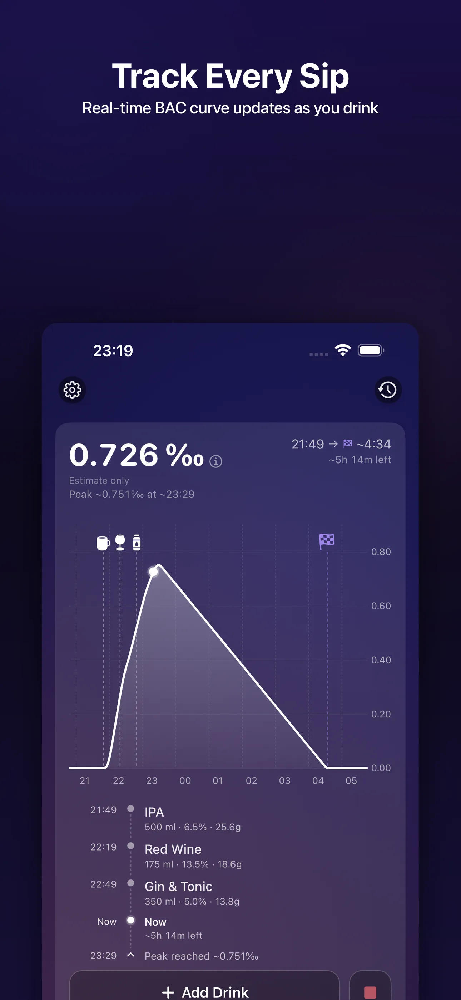
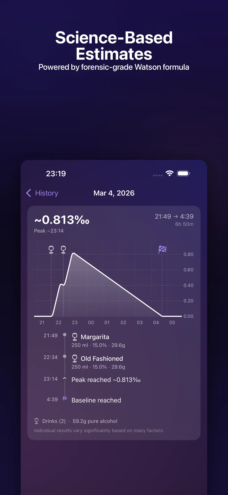
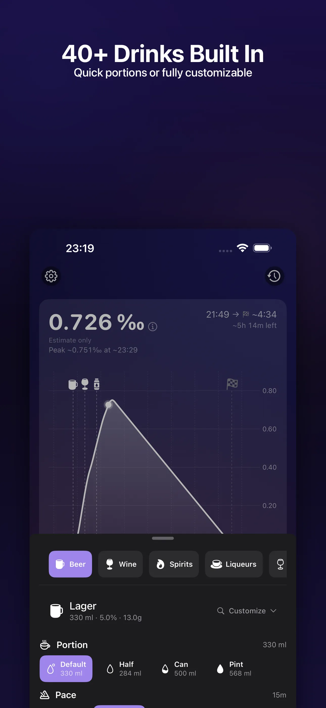

# SipLogger

Free educational BAC calculator & drink tracker for iPhone and iPad. No subscription, no ads, no data collection. Track drinks, see your estimated BAC curve, and understand alcohol metabolism — all locally on your device.

  

## What is SipLogger?

SipLogger is an educational alcohol metabolism tracker that uses the Watson Total Body Water method and the Widmark formula to estimate blood alcohol content over time. Log your drinks, see a real-time estimated BAC curve, and review session history — all with complete privacy.

**Completely free.** No subscription, no ads, no in-app purchases. Every feature is available from day one.

## Features

- **Real-Time Estimated BAC Curve** — Visualize absorption, peak, and metabolism phases
- **Watson + Widmark Formulas** — Scientifically-grounded estimated BAC calculations (±20% accuracy)
- **40+ Built-In Drinks** — Beer, wine, spirits, cocktails, and custom drinks
- **Drink Pace Modeling** — See how spacing affects your estimated BAC curve
- **HealthKit Integration** — Read-only access to weight, height, sex, age for personalized estimates
- **Session History & Diary** — Review past sessions with peak BAC, duration, and drink logs
- **Live Activities** — Monitor active sessions from Lock Screen and Dynamic Island
- **8 Languages** — English, Ukrainian, Polish, French, Spanish, German, Czech, Italian
- **Metric & Imperial** — Full support for both measurement systems
- **Privacy First** — No account, no backend servers, no analytics, all data stays on your device

## Screenshots

  
  
  

## Download

<a href="https://apps.apple.com/us/app/siplogger/id6758573311">Download SipLogger on the App Store</a> — requires iOS 17.0+.

## Links

- **Website:** [siplogger.app](https://siplogger.app)
- **Privacy Policy:** [siplogger.app/privacy](https://siplogger.app/privacy.html)

## Why Free?

SipLogger is an educational tool designed to help people understand alcohol metabolism. No subscription, no ads, no data collection — just a free, private app for responsible drinking awareness.

> **Disclaimer:** SipLogger is for educational and informational purposes only. Estimated BAC accuracy is ±20%. Never use estimated BAC to make decisions about driving or operating machinery. Rated 17+.

---

Made by [Unibrix](https://unibrix.com)
